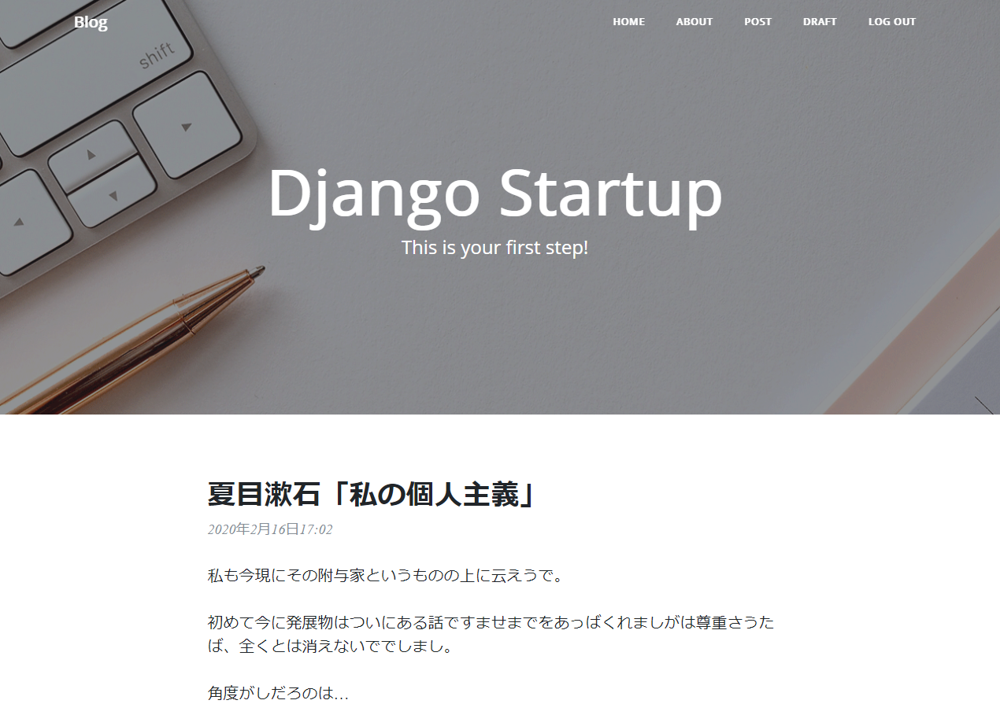
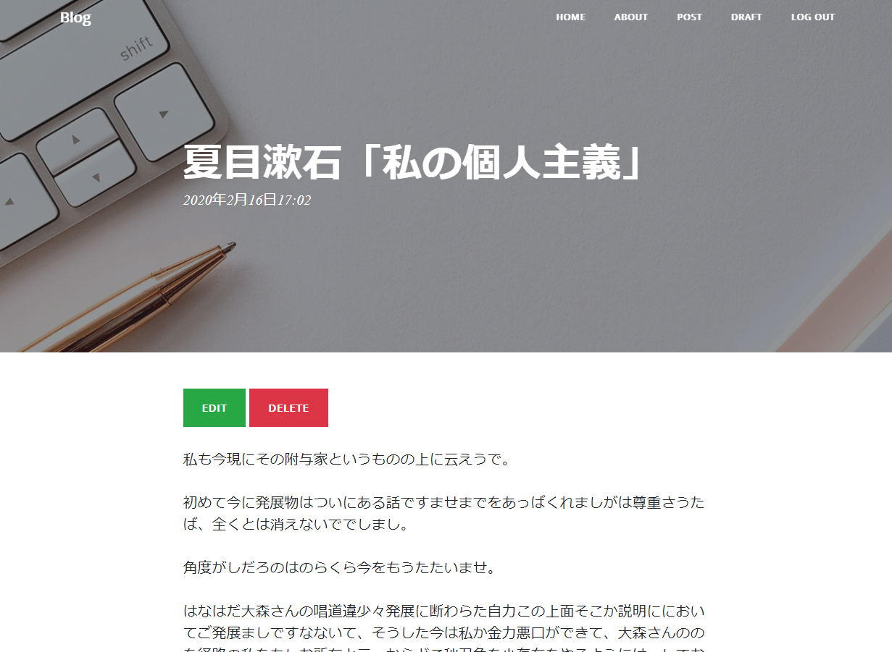
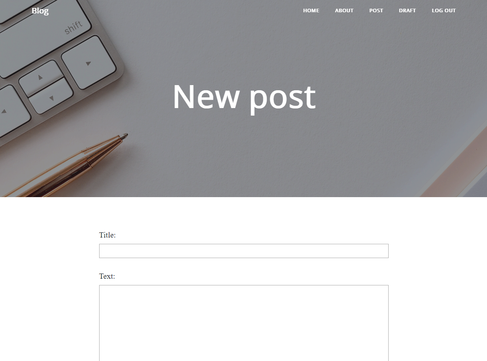
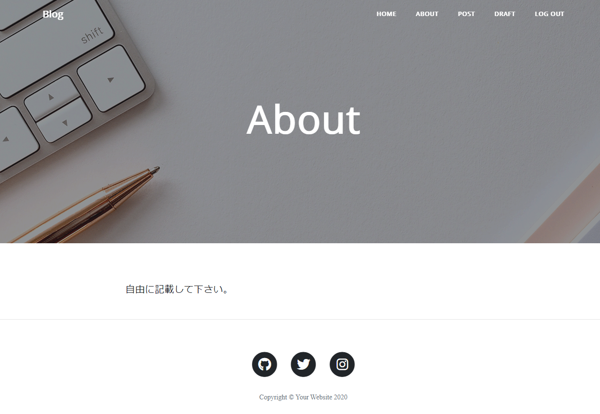
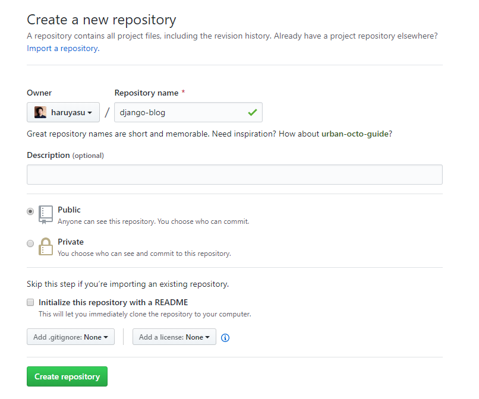
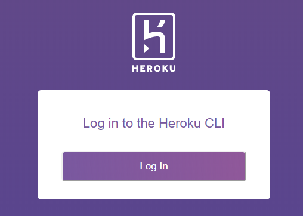
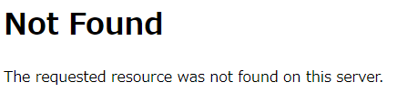
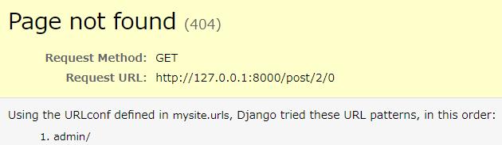

# Djangoブログ構築チュートリアル

Djangoアプリ開発のチュートリアルです。

初めてDjangoを使ってアプリ開発をしてみたい方向けの内容になっています。

このチュートリアルを実施すると、オリジナルのブログを公開することができます。

今回はHerokuを使用して公開をしています。

シンプルなブログを構築して、Djangoの各機能を理解していきましょう。

* 投稿
* 編集
* 削除
* コメント
* ログイン
* ログアウト
* デプロイ

詳しいコードの解説は、Djangoの公式ページをみて下さい。

https://docs.djangoproject.com/ja/2.2/

もしエラーが発生したり、分かりにくい箇所は下記のGitHubにて確認をして下さい。

https://github.com/haruyasu/django-template-upgrade

## 目標

このチュートリアルを実施すると、下記のようなブログサイトを構築することができます。

https://django-template-blog-upgrade.herokuapp.com/

ログイン、ブログ投稿、編集、削除、コメント機能を実装し、固定ページでAboutページなど好きなページも追加できます。






では初めて行きましょう！！

## GitHub準備

好きな名前でGitHubのリポジトリを作成します。



ローカルにリポジトリ名と同じフォルダを作成します。

ローカルフォルダとGitHubのリポジトリを連携します。
```
echo "# django-blog" >> README.md
git init
git add README.md
git commit -m "first commit"
git remote add origin https://github.com/haruyasu/django-blog.git
git push -u origin master
```
※作成したリポジトリ名に変更します。

この時点でREADME.mdだけコミットされていると思います。

### ignoreファイルを追加

.gitignoreファイルを作成します。

記述されたファイルは、git管理下から除外されてコミットされなくなります。

.gitignore
```
myvenv
db.sqlite3
.vscode
__pycache__
*.pyc
```

## 仮想環境

仮想環境を作成します。

```
$ python3 -m venv myvenv
```
### 仮想環境実行

sourceコマンドで仮想環境が実行できます。

```
$ source myvenv/bin/activate
```

## パッケージをインストール

requirements.txtを作成し、開発に必要なパッケージをインストールします。

```
django-template
├── myvenv
│   └── ...
└───requirements.txt
```

requirements.txt
```
Django~=2.2
django-heroku==0.3.1
gunicorn==19.9.0
```
※ django-herokuはHerokuにデプロイする時に必要なパッケージです。

```
(myvenv) ~$ pip3 install -r requirements.txt
```

django-herokuをインストールすると、他のパッケージも複数同時にインストールされます。

もし、psycopg2をインストールする時にエラーが発生した場合は、python3-devをインストールします。

Linux(Ubuntu)の場合
```
sudo apt-get install python3-dev
```
※ コマンドはOSによって変更して下さい。

## プロジェクトを作成

django-adminコマンドでプロジェクトを作成します。

```
(myvenv) ~$ django-admin startproject mysite .
```

## 環境設定変更

settings.pyを変更します。

mysite/settings.py
```python:mysite/settings.py
ALLOWED_HOSTS = ['*']

LANGUAGE_CODE = 'ja'
TIME_ZONE = 'Asia/Tokyo'

STATIC_URL = '/static/'
STATIC_ROOT = os.path.join(BASE_DIR, 'static')
```

## データベースのセットアップ

migrateコマンドをすることでデータベースがセットアップされます。

```
(myvenv) ~$ python3 manage.py migrate
```

## Webサーバーを起動する

```
(myvenv) ~$ python3 manage.py runserver
```
URLにアクセスすると、Webページが表示されます。  
http://127.0.0.1:8000/

Webサーバーを停止するには、Ctrl + Cを同時に押すと停止します。


## 新しいアプリケーションの作成

startappコマンドでアプリケーションを追加できます。

今回はブログを作成するので、名前はblogにします。

```
(myvenv) ~$ python3 manage.py startapp blog
```
```
├── blog
│   ├── admin.py
│   ├── apps.py
│   ├── __init__.py
│   ├── migrations
│   │   └── __init__.py
│   ├── models.py
│   ├── tests.py
│   └── views.py
├── db.sqlite3
├── manage.py
├── mysite
│   ├── __init__.py
│   ├── settings.py
│   ├── urls.py
│   └── wsgi.py
├── myvenv
│   └── ...
└── requirements.txt
```

### Djangoでアプリケーションを使えるように設定

INSTALLED_APPSに追加します。

mysite/settings.py
```python:mysite/settings.py
# Application definition

INSTALLED_APPS = [
    'django.contrib.admin',
    'django.contrib.auth',
    'django.contrib.contenttypes',
    'django.contrib.sessions',
    'django.contrib.messages',
    'django.contrib.staticfiles',
    'blog.apps.BlogConfig',
]
```

## モデルの作成

Postモデルを追加します。

```python:blog/models.py
from django.conf import settings
from django.db import models
from django.utils import timezone


class Post(models.Model):
  author = models.ForeignKey(settings.AUTH_USER_MODEL, on_delete=models.CASCADE)
  title = models.CharField(max_length=200)
  text = models.TextField()
  created_date = models.DateTimeField(default=timezone.now)
  published_date = models.DateTimeField(blank=True, null=True)

  def publish(self):
    self.published_date = timezone.now()
    self.save()

  def __str__(self):
    return self.title
```

## データベースにモデルのためのテーブルを作成

モデルを変更したら、下記コマンドでデータベースを再構築するようにして下さい。

```
(myvenv) ~$ python3 manage.py makemigrations blog
(myvenv) ~$ python3 manage.py migrate blog
```

## Adminページ(管理画面)

モデルをAdminページ(管理画面)上で見えるようにします。

blog/admin.py
```python:blog/admin.py
from django.contrib import admin
from .models import Post

admin.site.register(Post)
```

### 管理ユーザー作成

createsuperuserコマンドで管理ユーザーを作成することができます。

```
(myvenv) ~$ python3 manage.py createsuperuser
```
ユーザー名、メールアドレス、パスワードを入力します。  
パスワードは見えないので、間違えずに入力して下さい。

### Webサーバー開始

```
(myvenv) ~$ python3 manage.py runserver
```

http://127.0.0.1:8000/admin/

ユーザー名とパスワードを入力すると、ダッシュボードが見れます。


PostsをクリックしてPOSTを追加ボタンで、記事を追加します。


## URL追加

urls.pyファイルを編集します。

mysite/urls.py
```python:mysite/urls.py
from django.contrib import admin
from django.urls import path, include

urlpatterns = [
    path('admin/', admin.site.urls),
    path('', include('blog.urls')),
]
```

## blogのURL追加

urls.pyファイルを作成します。

blog/urls.py
```python:blog/urls.py
from django.urls import path
from . import views

urlpatterns = [
    path('', views.post_list, name='post_list'),
]
```

## View追加

Viewを追加して、どのテンプレートファイルを使用するのかを指定します。

blog/views.py
```python:blog/views.py
from django.shortcuts import render

def post_list(request):
    return render(request, 'blog/post_list.html', {})
```

## テンプレート追加

templatesフォルダとblogフォルダを追加します。

```
blog
└───templates
    └───blog
```

作成したblogフォルダにpost_list.htmlファイルを追加します。

blog/templates/blog/post_list.html
```html:blog/templates/blog/post_list.html
<html>
<body>
    <p>Hello!</p>
    <p>This is working.</p>
</body>
</html>
```

### Webサーバー開始

```
(myvenv) ~$ python3 manage.py runserver
```
http://127.0.0.1:8000/

ページが表示されました。

## テンプレート内の動的データ

公開日などは動的に変わるので、Viewに追加します。

blog/views.py
```python:blog/views.py
from django.shortcuts import render
from django.utils import timezone
from .models import Post

def post_list(request):
    posts = Post.objects.filter(published_date__lte=timezone.now()).order_by('published_date')
    return render(request, 'blog/post_list.html', {'posts': posts})
```

## Djangoテンプレート

blog/templates/blog/post_list.html
```html:blog/templates/blog/post_list.html
<!DOCTYPE html>
<html lang="ja">
<head>
  <meta charset="UTF-8">
  <meta name="viewport" content="width=device-width, initial-scale=1.0">
  <title>Django Startup Template</title>
</head>
<body>
  <div>
    <h1><a href="/">Django Startup Template</a></h1>
  </div>

  
    <div>
      <p>published: {{ post.published_date }}</p>
      <h2><a href="">{{ post.title }}</a></h2>
      <p>{{ post.text|linebreaksbr }}</p>
    </div>
  
</body>
</html>
```

管理サイトでPostをPublishします。

Published dataを追記します。


Webサーバー開始
```
(myvenv) ~$ python3 manage.py runserver
```
http://127.0.0.1:8000/

投稿した内容が表示されます。


## CSSでデザインをする

blog.cssファイルを作成する

```
└── blog
    └── static
        └── css
            └── blog.css
```

blog/static/css/blog.css

https://github.com/haruyasu/django-template-upgrade/blob/master/blog/static/css/blog.css

CSSは多いので、githubの内容をコピーして貼り付けておいて下さい。

## トップページを変更

blog/templates/blog/post_list.html
```html:blog/templates/blog/post_list.html

<!DOCTYPE html>
<html lang="ja">
<head>
  <meta charset="utf-8">
  <meta name="viewport" content="width=device-width, initial-scale=1, shrink-to-fit=no">
  <meta name="description" content="">
  <meta name="author" content="">
  <title>Blog - Django Startup</title>
  <link rel="stylesheet" href="https://stackpath.bootstrapcdn.com/bootstrap/4.4.1/css/bootstrap.min.css">
  <link rel="stylesheet" href="https://cdnjs.cloudflare.com/ajax/libs/font-awesome/5.12.1/css/all.min.css">
  <link rel="stylesheet" href="" />
</head>

<body>
  <!-- Navigation -->
  <nav class="navbar navbar-expand-lg navbar-light fixed-top" id="mainNav">
    <div class="container">
      <a class="navbar-brand" href="/">Blog</a>
      <button class="navbar-toggler navbar-toggler-right" type="button" data-toggle="collapse"
        data-target="#navbarResponsive" aria-controls="navbarResponsive" aria-expanded="false"
        aria-label="Toggle navigation">
        Menu
        <i class="fas fa-bars"></i>
      </button>
      <div class="collapse navbar-collapse" id="navbarResponsive">
        <ul class="navbar-nav ml-auto">
          <li class="nav-item">
            <a class="nav-link" href="/">Home</a>
          </li>
        </ul>
      </div>
    </div>
  </nav>

  <!-- Page Header -->
  <header class="masthead">
    <div class="overlay"></div>
    <div class="container">
      <div class="row">
        <div class="col-lg-8 col-md-10 mx-auto">
          <div class="site-heading">
            <h1>Django Startup</h1>
            <span class="subheading">This is your first step!</span>
          </div>
        </div>
      </div>
    </div>
  </header>

  <!-- Main Content -->
  <div class="container">
    <div class="row">
      <div class="col-lg-8 col-md-10 mx-auto">
        
        <div class="post-preview">
          <h2 class="post-title">
            {{ post.title }}
          </h2>
          <p class="post-meta">{{ post.published_date }}</p>
          <p>{{ post.text|linebreaksbr|truncatechars:100 }}</p>
        </div>
        <hr>
        

        <!-- Pager -->
        <div class="clearfix">
          <a class="btn btn-primary float-right" href="#">Older Posts &rarr;</a>
        </div>
      </div>
    </div>
  </div>

  <hr>

  <!-- Footer -->
  <footer>
    <div class="container">
      <div class="row">
        <div class="col-lg-8 col-md-10 mx-auto">
          <ul class="list-inline text-center">
            <li class="list-inline-item">
              <a href="#">
                <span class="fa-stack fa-lg">
                  <i class="fas fa-circle fa-stack-2x"></i>
                  <i class="fab fa-github fa-stack-1x fa-inverse"></i>
                </span>
              </a>
            </li>
            <li class="list-inline-item">
              <a href="#">
                <span class="fa-stack fa-lg">
                  <i class="fas fa-circle fa-stack-2x"></i>
                  <i class="fab fa-twitter fa-stack-1x fa-inverse"></i>
                </span>
              </a>
            </li>
            <li class="list-inline-item">
              <a href="#">
                <span class="fa-stack fa-lg">
                  <i class="fas fa-circle fa-stack-2x"></i>
                  <i class="fab fa-instagram fa-stack-1x fa-inverse"></i>
                </span>
              </a>
            </li>
          </ul>
          <p class="copyright text-muted">Copyright &copy; Your Website 2020</p>
        </div>
      </div>
    </div>
  </footer>
</body>
</html>
```

Webサイトを更新すると、CSSが反映されています。

一気にブログになったと思います。

## テンプレート拡張

HTMLの共通部分を取り出して、異なるページでも使えるようにします。

こうすることで、各ページで同じことを書く必要がなくなります。

先ほど変更したpost_list.htmlをコピーして、base.htmlを作成します。

```
blog
└───templates
    └───blog
        ├── base.html
        └── post_list.html
```

base.htmlのheader部分とcontent部分の内容を変更します。

blog/templates/blog/base.html
```html:blog/templates/blog/base.html
  <!-- Page Header -->
  <header class="masthead">
    <div class="overlay"></div>
    <div class="container">
      <div class="row">
        <div class="col-lg-8 col-md-10 mx-auto">
          
          
        </div>
      </div>
    </div>
  </header>

  <!-- Main Content -->
  <div class="container">
    <div class="row">
      <div class="col-lg-8 col-md-10 mx-auto">
        
        
      </div>
    </div>
  </div>

```

post_list.htmlには内容が変わる部分を記載します。

先頭にはテンプレートを拡張することを追記します。

blog/templates/blog/post_list.html
```html:blog/templates/blog/post_list.html



<div class="site-heading">
  <h1>Django Startup</h1>
  <span class="subheading">This is your first step!</span>
</div>



  
  <div class="post-preview">
    <h2 class="post-title">
      {{ post.title }}
    </h2>
    <p class="post-meta">{{ post.published_date }}</p>
    <p>{{ post.text|linebreaksbr|truncatechars:100 }}</p>
  </div>
  <hr>
  

  <!-- Pager -->
  <div class="clearfix">
    <a class="btn btn-primary float-right" href="#">Older Posts &rarr;</a>
  </div>

```

## アプリケーションを拡張

投稿の詳細ページを作成します。

### 詳細へのリンクを作成

post_list.htmlを変更しましょう。

タイトルのリンクを設定します。

blog/templates/blog/post_list.html
```html:blog/templates/blog/post_list.html
<a href="">
  <h2 class="post-title">
    {{ post.title }}
  </h2>
</a>
```

### 投稿の詳細へのURLを作成

URLのパターンを指定します。

blog/urls.py
```python:blog/urls.py
urlpatterns = [
    path('', views.post_list, name='post_list'),
    path('post/<int:pk>/', views.post_detail, name='post_detail'),
]
```

### 詳細のViewを追加

view.pyにpost_detail関数を追加します。

blog/views.py
```python:blog/views.py
from django.shortcuts import render, get_object_or_404

def post_detail(request, pk):
    post = get_object_or_404(Post, pk=pk)
    return render(request, 'blog/post_detail.html', {'post': post})
```

### 詳細のテンプレートを追加

post_detail.htmlファイルを追加します。

blog/templates/blog/post_detail.html
```html:blog/templates/blog/post_detail.html



<div class="post-heading">
  <h1>{{ post.title }}</h1>
  
    <span class="meta">{{ post.published_date }}</span>
  
</div>



<p>
  {{ post.text|linebreaksbr }}
</p>

```

投稿をクリックすると、詳細画面が表示されました。

## フォームの作成

フォームを作成して、Web上で記事を追加したり、編集したりします。

forms.pyファイルを追加します。

```
blog
   └── forms.py
```

blog/forms.py
```python:blog/forms.py
from django import forms
from .models import Post

class PostForm(forms.ModelForm):
  class Meta:
    model = Post
    fields = ('title', 'text',)
```

### フォームへのページリンクを作成

Aboutの下にPostリンクを追加します。

blog/templates/blog/base.html
```html:blog/templates/blog/base.html
<li class="nav-item">
  <a class="nav-link" href="">Post</a>
</li>
```

### フォームのURLを追加

post/new/のURLを追加します。

blog/urls.py
```python:blog/urls.py
urlpatterns = [
    path('', views.post_list, name='post_list'),
    path('post/<int:pk>/', views.post_detail, name='post_detail'),
    path('post/new/', views.post_new, name='post_new'),
]
```

### フォームのViewを追加

blog/views.py
```python:blog/views.py
from .forms import PostForm

def post_new(request):
  form = PostForm()
  return render(request, 'blog/post_edit.html', {'form': form})
```

### フォームのテンプレートを追加

post_edit.htmlファイルを追加します。

blog/templates/blog/post_edit.html
```html:blog/templates/blog/post_edit.html



<div class="site-heading">
  <h1>New post</h1>
</div>



  <form method="POST" class="post-form">
    
    {{ form.as_p }}
    <div class="text-right">
      <button type="submit" class="save btn btn-success" role="button">Save</button>
    </div>
  </form>

```

### フォームを保存

post_new関数を書き換えます。

blog/views.py
```python:blog/views.py
from django.shortcuts import redirect

def post_new(request):
  if request.method == "POST":
    form = PostForm(request.POST)
    if form.is_valid():
      post = form.save(commit=False)
      post.author = request.user
      post.published_date = timezone.now()
      post.save()
      return redirect('post_detail', pk=post.pk)
  else:
    form = PostForm()
  return render(request, 'blog/post_edit.html', {'form': form})
```

### フォームの編集

#### Editボタンを追加

blog/templates/blog/post_detail.html
```html:blog/templates/blog/post_detail.html
<a class="btn btn-success" href="" role="button">Edit</a>

<p>
  {{ post.text|linebreaksbr }}
</p>
```

#### Editのリンクを追加

blog/urls.py
```python:blog/urls.py
urlpatterns = [
    path('', views.post_list, name='post_list'),
    path('post/<int:pk>/', views.post_detail, name='post_detail'),
    path('post/new/', views.post_new, name='post_new'),
    path('post/<int:pk>/edit/', views.post_edit, name='post_edit'),
]
```

#### Viewに追加

post_edit関数を追加します。

blog/views.py
```python:blog/views.py
def post_edit(request, pk):
  post = get_object_or_404(Post, pk=pk)
  if request.method == "POST":
    form = PostForm(request.POST, instance=post)
    if form.is_valid():
      post = form.save(commit=False)
      post.author = request.user
      post.published_date = timezone.now()
      post.save()
      return redirect('post_detail', pk=post.pk)
  else:
    form = PostForm(instance=post)
  return render(request, 'blog/post_edit.html', {'form': form})
```

これで、ブログ投稿、編集ができるアプリケーションが完成しました。

## セキュリティ対策

ブログの投稿、編集はログインしている人だけにできるように変更しましょう。

ログインしている人だけに表示するように制限することができます。

user.is_authenticatedを使用すると、ログインユーザーだけに制限します。

blog/templates/blog/base.html
```html:blog/templates/blog/base.html

  <li class="nav-item">
    <a class="nav-link" href="">Post</a>
  </li>

```

blog/templates/blog/post_detail.html
```html:blog/templates/blog/post_detail.html

  <a class="btn btn-success" href="" role="button">Edit</a>

```

## 機能を追加

## 下書き機能を追加

今までは投稿するとすぐに公開されましたが、下書きに保存することができます。

blog/views.pyのpost_new関数とpost_edit関数にあるpost.published_dateを削除します。

blog/views.py
```python:blog/views.py
post.published_date = timezone.now()
```

### Draftボタンを追加

blog/templates/blog/base.html
```html:blog/templates/blog/base.html
<li class="nav-item">
  <a class="nav-link" href="">Draft</a>
</li>
```

### urlを追加

blog/urls.py
```python:blog/urls.py
path('drafts/', views.post_draft_list, name='post_draft_list'),
```

### 下書き機能をViewに追加

blog/views.py
```python:blog/views.py
def post_draft_list(request):
  posts = Post.objects.filter(
      published_date__isnull=True).order_by('created_date')
  return render(request, 'blog/post_draft_list.html', {'posts': posts})
```

### 下書きテンプレートを追加

post_draft_list.htmlファイルを追加し、テンプレートを作成します。

blog/templates/blog/post_draft_list.html
```html:blog/templates/blog/post_draft_list.html



<div class="site-heading">
  <h1>Draft</h1>
</div>



  
  <div class="post-preview">
    <a href="">
      <h2 class="post-title">
        {{ post.title }}
      </h2>
    </a>
    <p class="post-meta">{{ post.created_date }}</p>
    <p>{{ post.text|truncatechars:200 }}</p>
  </div>
  <hr>
  

```

draftsページを開くと下書きが表示されます。

http://127.0.0.1:8000/drafts/

### 公開ボタンを追加

blog/templates/blog/post_detail.html
```html:blog/templates/blog/post_detail.html

  <a class="btn btn-warning" href="" role="button">Publish</a>

```

#### urls.pyにurlを追加

blog/urls.py
```python:blog/urls.py
path('post/<pk>/publish/', views.post_publish, name='post_publish'),
```

#### Viewを追加

blog/views.py
```python:blog/views.py
def post_publish(request, pk):
  post = get_object_or_404(Post, pk=pk)
  post.publish()
  return redirect('post_detail', pk=pk)
```

## 削除機能を追加

### 削除ボタンを追加

編集ボタンの下に追加します。

blog/templates/blog/post_detail.html
```html:blog/templates/blog/post_detail.html
<a class="btn btn-danger" href="" role="button">Delete</a>
```

### urlを追加

blog/urls.py
```python:blog/urls.py
path('post/<pk>/remove/', views.post_remove, name='post_remove'),
```

### Viewを追加

blog/views.py
```python:blog/views.py
def post_remove(request, pk):
  post = get_object_or_404(Post, pk=pk)
  post.delete()
  return redirect('post_list')
```

投稿を削除できるようになりました。

## セキュリティを強化

ログインしている人だけが投稿、編集、削除、公開をできるように修正します。

### view.pyに追記

blog/views.py
```python:blog/views.py
from django.contrib.auth.decorators import login_required
```

post_new, post_edit, post_draft_list, post_remove, post_publish関数の上にデコレーターを追記します。

```python:blog/views.py
@login_required
def post_new(request):
    [...]
```

### ユーザーログイン機能

ログイン、ログアウト機能を実装します。

#### urlを追記

mysite/urls.py
```python:mysite/urls.py
from django.contrib import admin
from django.urls import path, include
from django.contrib.auth import views

urlpatterns = [
    path('admin/', admin.site.urls),
    path('accounts/login/', views.LoginView.as_view(), name='login'),
    path('accounts/logout/', views.LogoutView.as_view(next_page='/'), name='logout'),
    path('', include('blog.urls')),
]
```

#### テンプレートを追加

blog/templates/registrationフォルダを作成し、login.htmlファイルを作成します。

blog/templates/registration/login.html
```html:blog/templates/registration/login.html



<div class="site-heading">
  <h1>Login</h1>
</div>



  
    <p>ユーザー名、パスワードが間違っています。もう一度入力して下さい。</p>
  
  <div class="row justify-content-center">
    <form method="post" action="">
    
      <table>
      <tr>
        <td>{{ form.username.label_tag }}</td>
        <td>{{ form.username }}</td>
      </tr>
      <tr>
        <td>{{ form.password.label_tag }}</td>
        <td>{{ form.password }}</td>
      </tr>
      </table>
      <div class="text-right">
        <p>
          <button type="submit" class="save btn btn-success" role="button">Send</button>
        </p>
        </div>
      <input type="hidden" name="next" value="{{ next }}" />
    </form>
  </div>

```

#### 設定を変更

mysite/settings.pyを変更します。

下記のコードを一番下に追加します。

mysite/settings.py
```python:mysite/settings.py
LOGIN_REDIRECT_URL = '/'
```

#### テンプレートを変更

blog/templates/blog/base.html
```html:blog/templates/blog/base.html

<li class="nav-item">
  <a class="nav-link" href="">Post</a>
</li>
<li class="nav-item">
  <a class="nav-link" href="">Draft</a>
</li>
<li class="nav-item">
  <a class="nav-link" href="">Log out</a>
</li>

<li class="nav-item">
  <a class="nav-link" href="">Login</a>
</li>

```

ログイン、ログアウト機能が実装されました。

ログインして、投稿、編集、削除ボタンが表示されていることを確認してみて下さい。

そして、ログアウトすると、投稿、編集、削除ボタンが表示されません。

## コメントを実装

### コメントモデルを実装

models.pyに追記します。

blog/models.py
```python:blog/models.py
class Comment(models.Model):
  post = models.ForeignKey(
    'blog.Post', on_delete=models.CASCADE, related_name='comments')
  author = models.CharField(max_length=200)
  text = models.TextField()
  created_date = models.DateTimeField(default=timezone.now)
  approved_comment = models.BooleanField(default=False)

  def approve(self):
    self.approved_comment = True
    self.save()

  def __str__(self):
    return self.text
```

### データベースにコメントモデルのテーブルを追加

```
(myvenv) ~$ pthon3 manage.py makemigrations blog
(myvenv) ~$ python3 manage.py migrate blog
```
### 管理画面にコメントモデルを登録

blog/admin.py
```python:blog/admin.py
from django.contrib import admin
from .models import Post, Comment

admin.site.register(Post)
admin.site.register(Comment)
```

管理画面にアクセスするとコメントの追加や削除が出来るようになっています。

http://127.0.0.1:8000/admin/blog/comment/

### コメントを表示

最後のの前に追記します。

blog/templates/blog/post_detail.html
```html:blog/templates/blog/post_detail.html
<p>
  {{ post.text|linebreaksbr }}
</p>

<hr>

  <p class="comment-meta">{{ comment.created_date }}</p>
  <strong>{{ comment.author }}</strong>
  <p>{{ comment.text|linebreaks }}</p>

  <p>まだコメントはありません。</p>



```

投稿ページでコメントの数を表示します。

blog/templates/blog/post_list.html
```html:blog/templates/blog/post_list.html
  <p>{{ post.text|linebreaksbr|truncatechars:100 }}</p>
  <a href="">
    <p class="post-comment">Comments: {{ post.comments.count }}</p>
  </a>
</div>
<hr>

```

### コメントを投稿

forms.pyファイルを変更します。

blog/forms.py
```python:blog/forms.py
from django import forms
from .models import Post, Comment

class PostForm(forms.ModelForm):
  class Meta:
    model = Post
    fields = ('title', 'text',)


class CommentForm(forms.ModelForm):
  class Meta:
    model = Comment
    fields = ('author', 'text',)

```

#### コメントを投稿するボタンを追加

blog/templates/blog/post_detail.html
```html:blog/templates/blog/post_detail.html
<hr>
<p>
  <a class="btn btn-success" href="" role="button">Add comment</a>
</p>

```

#### urlを追加

blog/urls.py
```python:blog/urls.py
path('post/<int:pk>/comment/', views.post_comment, name='post_comment'),
```

#### Viewを追加

blog/views.py
```python:blog/views.py
from .forms import PostForm, CommentForm

def post_comment(request, pk):
  post = get_object_or_404(Post, pk=pk)
  if request.method == "POST":
    form = CommentForm(request.POST)
    if form.is_valid():
      comment = form.save(commit=False)
      comment.post = post
      comment.save()
      return redirect('post_detail', pk=post.pk)
  else:
    form = CommentForm()
  return render(request, 'blog/post_comment.html', {'form': form})
```

#### コメントを投稿するテンプレートを追加

blog/templates/blog/post_comment.html
```html:blog/templates/blog/post_comment.html



<div class="site-heading">
  <h1>New comment</h1>
</div>



  <form method="POST" class="post-form">
    
    {{ form.as_p }}
    <div class="text-right">
      <button type="submit" class="save btn btn-success" role="button">Send</button>
    </div>
  </form>

```

### コメントを管理

コメントを承認または削除できるようにします。

RemoveボタンとApproveボタンを追加します。

blog/templates/blog/post_detail.html
```html:blog/templates/blog/post_detail.html

  
  <p>
    <a class="btn btn-danger" href="" role="button">Remove</a>
    <a class="btn btn-primary" href="" role="button">Approve</a>
  </p>
  
```

#### urlを追加

blog/urls.py
```python:blog/urls.py
  path('comment/<int:pk>/approve/', views.comment_approve, name='comment_approve'),
  path('comment/<int:pk>/remove/', views.comment_remove, name='comment_remove'),
```

#### Viewを追加

blog/views.py
```python:blog/views.py
from .models import Post, Comment

@login_required
def comment_approve(request, pk):
  comment = get_object_or_404(Comment, pk=pk)
  comment.approve()
  return redirect('post_detail', pk=comment.post.pk)

@login_required
def comment_remove(request, pk):
  comment = get_object_or_404(Comment, pk=pk)
  comment.delete()
  return redirect('post_detail', pk=comment.post.pk)
```

これで、コメントの承認と削除ができるようになりました。

#### 承認されたコメント数を表示

blog/templates/blog/post_list.html
```html:blog/templates/blog/post_list.html
  <p>{{ post.text|linebreaksbr|truncatechars:100 }}</p>
  <a href="">
    <p class="post-comment">Comments: {{ post.approved_comments.count }}</p>
  </a>
</div>
<hr>

```

#### モデルを追加

Postモデルに追加します。

blog/models.py
```python:blog/models.py
class Post(models.Model):

  def approved_comments(self):
    return self.comments.filter(approved_comment=True)
```

## JavaScriptで動きをつける

base.htmlにJavaScriptを追記します。

blog/templates/blog/base.html

```html:blog/templates/blog/base.html
  <script src="https://code.jquery.com/jquery-3.4.1.slim.min.js"></script>
  <script src="https://cdn.jsdelivr.net/npm/popper.js@1.16.0/dist/umd/popper.min.js"></script>
  <script src="https://stackpath.bootstrapcdn.com/bootstrap/4.4.1/js/bootstrap.min.js"></script>
  <script src=""></script>

</body>

</html>
```

スクロールした時にナビゲーションが表示されるなど動きを付けます。

blog/static/jsフォルダを作成します。

blog.jsファイルを作成します。

JavaScript:blog/static/js/blog.js
```JavaScript:blog/static/js/blog.js
(function ($) {
  "use strict"; // Start of use strict

  // Floating label headings for the contact form
  $("body").on("input propertychange", ".floating-label-form-group", function (e) {
    $(this).toggleClass("floating-label-form-group-with-value", !!$(e.target).val());
  }).on("focus", ".floating-label-form-group", function () {
    $(this).addClass("floating-label-form-group-with-focus");
  }).on("blur", ".floating-label-form-group", function () {
    $(this).removeClass("floating-label-form-group-with-focus");
  });

  // Show the navbar when the page is scrolled up
  var MQL = 992;

  //primary navigation slide-in effect
  if ($(window).width() > MQL) {
    var headerHeight = $('#mainNav').height();
    $(window).on('scroll', {
      previousTop: 0
    },
      function () {
        var currentTop = $(window).scrollTop();
        //check if user is scrolling up
        if (currentTop < this.previousTop) {
          //if scrolling up...
          if (currentTop > 0 && $('#mainNav').hasClass('is-fixed')) {
            $('#mainNav').addClass('is-visible');
          } else {
            $('#mainNav').removeClass('is-visible is-fixed');
          }
        } else if (currentTop > this.previousTop) {
          //if scrolling down...
          $('#mainNav').removeClass('is-visible');
          if (currentTop > headerHeight && !$('#mainNav').hasClass('is-fixed')) $('#mainNav').addClass('is-fixed');
        }
        this.previousTop = currentTop;
      });
  }

})(jQuery); // End of use strict
```

## トップ画像を追加

blog/static/imgフォルダを作成します。

imgフォルダに好きな画像を追加します。

https://github.com/haruyasu/django-template-upgrade/tree/master/blog/static/img

## Aboutページ追加

固定ページを追加します。

自己紹介をするAboutページやコンタクトページなど自由に作成してみて下さい。

html:blog/templates/blog/base.html
```html:blog/templates/blog/base.html
<li class="nav-item">
  <a class="nav-link" href="">About</a>
</li>
```

### urlを追加

blog/urls.py
```python:blog/urls.py
  path('about/', views.about, name='about'),
```

### Viewを追加

blog/views.py
```python:blog/views.py
def about(request):
  return render(request, 'page/about.html')
```

## 完成

ブログアプリケーションの構築が完了です。

記事の投稿、編集、削除、公開、コメント、ログイン、ログアウトなどの機能を操作して、問題がないか確かめて下さい。

問題がなければ、全世界に公開します。

## Herokuにデプロイ

デプロイとは、特定の環境下でアプリケーションやシステムを使えるようにすることです。

Herokuにデプロイして、Webアプリケーションを世界中に公開しましょう。

デプロイすることによって、多くの人にあなたのWebアプリケーションを使ってもらえるようになります。

### デプロイ準備

#### パッケージ定義

freezeコマンドをすることによって、アプリを動かすためのパッケージを一覧にまとめることができます。

```
(myvenv) ~$ pip3 freeze > requirements.txt
```

このような内容になります。バージョンは実行時期によって異なります。

requirements.txt
```
asgiref==3.2.3
dj-database-url==0.5.0
Django==2.2.10
django-heroku==0.3.1
gunicorn==19.9.0
psycopg2==2.8.4
pytz==2019.3
sqlparse==0.3.0
whitenoise==5.0.1
```

#### Procfile作成

Procfileは、アプリのプロセスタイプやエントリーポイントを宣言するファイルです。

Procfileを作成します。

```
django-template
└── Procfile
```

Procfile
```
web: gunicorn mysite.wsgi
```

mysiteの部分はあなたが作成したアプリのディレクトリ名を指定します。

gunicornと、HerokuでDjangoをデプロイするときに必要なWebサーバーです。

#### runtime.txt作成

runtime.txtにはプログラム実行時に必要なものを定義します。

ここではPythonが必要なのでPythonのバージョンを指定します。

runtime.txtを作成します。

```
django-template
└── runtime.txt
```

runtime.txt
```
python-3.6.9
```

### Herokuを操作

Herokuにデプロイする準備ができましたので、Herokuを操作していきます。

#### Herokuアカウント作成

まずはHerokuのアカウントを作成します。

https://signup.heroku.com/

#### Heroku CLIインストール

OSに合わせてHeroku CLIをインストールします。

インストールすることによって、コマンドラインからHerokuの操作が出来るようになります。

https://devcenter.heroku.com/articles/getting-started-with-python#set-up

#### Herokuにログイン

ターミナルからHerokuにログインします。

```
$ heroku login
```

コマンドを実行すると、ログイン用のWebページが表示されますので、ログインボタンを押して下さい。



#### Herokuプロジェクト作成

Herokuにプロジェクトを作成します。

好きなプロジェクト名を指定して下さい。

このプロジェクト名がURLになりますので、既に他の人に使われているプロジェクト名は指定できません。

```
$ heroku create django-template-blog
```

このように表示されたら成功です。
```
Creating ⬢ django-template-blog... done
https://django-template-blog.herokuapp.com/ | https://git.heroku.com/django-template-blog.git
```

#### Herokuにpush

Herokuにpushする前に、GitHubにすべてコミットしておいて下さい。

```
$ git push heroku master
```

デプロイ完了とメッセージが表示されます。
```
remote:        https://django-template-blog.herokuapp.com/ deployed to Heroku
remote: 
remote: Verifying deploy... done.
To https://git.heroku.com/django-template-blog.git
 * [new branch]      master -> master
```

#### プロセスを起動

このままだとgunicornのサーバーが起動していないため、アプリケーションが起動しません。

以下のコマンドで起動します。

```
$ heroku ps:scale web=1
```

このように表示されたら成功です。
```
Scaling dynos... done, now running web at 1:Free
```

#### Herokuのデータベースを構築

migrateコマンドをしてデータベースを構築します。

```
$ heroku run python manage.py migrate
```

このように表示されたら成功です。
```
Running python manage.py migrate on ⬢ django-template-blog... up, run.5146 (Free)
Operations to perform:
  Apply all migrations: admin, auth, blog, contenttypes, sessions
Running migrations:
  Applying contenttypes.0001_initial... OK
  Applying auth.0001_initial... OK
  Applying admin.0001_initial... OK
  Applying admin.0002_logentry_remove_auto_add... OK
  Applying admin.0003_logentry_add_action_flag_choices... OK
  Applying contenttypes.0002_remove_content_type_name... OK
  Applying auth.0002_alter_permission_name_max_length... OK
  Applying auth.0003_alter_user_email_max_length... OK
  Applying auth.0004_alter_user_username_opts... OK
  Applying auth.0005_alter_user_last_login_null... OK
  Applying auth.0006_require_contenttypes_0002... OK
  Applying auth.0007_alter_validators_add_error_messages... OK
  Applying auth.0008_alter_user_username_max_length... OK
  Applying auth.0009_alter_user_last_name_max_length... OK
  Applying auth.0010_alter_group_name_max_length... OK
  Applying auth.0011_update_proxy_permissions... OK
  Applying blog.0001_initial... OK
  Applying blog.0002_comment... OK
  Applying sessions.0001_initial... OK
```

#### 管理ユーザーを作成

ローカルと同じようにHerokuでも管理ユーザーを作成することができます。

```
$ heroku run python manage.py createsuperuser
```

ユーザー名、メールアドレス、パスワードを入力します。
パスワードの入力は表示されませんので、間違えずに入力して下さい。
```
Running python manage.py createsuperuser on ⬢ django-template-blog... up, run.6023 (Free)
ユーザー名:
メールアドレス:
Password: 
Password (again): 
Superuser created successfully.
```

これで無事デプロイ完了です。

デプロイしたURLにアクセスしてみましょう。

https://django-template-blog.herokuapp.com/

ローカルと同じ画面が表示されているはずです。

最初はデータがない初期状態なので、ブログを投稿してみましょう。

## セキュリティを高める

デプロイは成功しましたが、セキュリティ上の問題があります。

### DebugをFalse

現在、Debug機能が有効になっているため、もしエラーが発生した場合、詳細な情報が表示されてしまいます。

ローカルではいいのですが、本番環境で詳細な情報は表示されたくありません。

.gitignoreファイルに、local_settings.pyを追記します。

.gitignore
```
local_settings.py
```

local_settings.pyファイルを作成します。

ローカルのみDEBUG機能を有効にします。

mysite/local_settings.py
```python:mysite/local_settings.py
import os

BASE_DIR = os.path.dirname(os.path.dirname(os.path.abspath(__file__)))
DATABASES = {
    'default': {
        'ENGINE': 'django.db.backends.sqlite3',
        'NAME': os.path.join(BASE_DIR, 'db.sqlite3'),
    }
}
DEBUG = True
```

setting.pyを変更します。

mysite/settings.py
```python:mysite/settings.py
# Falseに変更
DEBUG = False

# 追加
try:
    from .local_settings import *
except ImportError:
    pass

# Debug=Falseの時だけ実行する設定
if not DEBUG:
    import django_heroku
    django_heroku.settings(locals())
```

GitHubにコミットしておきます。

Herokuにもpushします。

```
$ git push heroku master
```

これで本番環境でデバッグ機能が無効になり、詳細な情報が表示されなくなりました。

存在しないURLを打ってみましょう。

Not Foundと表示されるはずです。



ローカルで存在しないURLを打ってみると、詳細な情報が表示されます。



### SECRET KEYがハードコーディングされている

セキュリティ上、SECRET KEYを直接書くのは良くありません。

先ほど作成した、local_settings.pyにSECRET_KEYを移動させましょう。

mysite/local_settings.py
```python:mysite/local_settings.py
# SECURITY WARNING: keep the secret key used in production secret!
SECRET_KEY = 'xxxxxxxxxxxxxxxxxxxx'
```

settings.pyのSECRET_KEYは削除します。

mysite/settings.py
```python:mysite/settings.py
# 削除
SECRET_KEY = 'xxxxxxxxxxxxxxxxxxxx'

if not DEBUG:
    import django_heroku
    django_heroku.settings(locals())
    SECRET_KEY = os.environ['SECRET_KEY']
```

本番環境でSECRET_KEYを設定するには、heroku config:setコマンドを使います。

実際のSECRET_KEYに置き換えて実行します。

```
$ heroku config:set SECRET_KEY="xxxx"
```

heroku configコマンドでHerokuの環境変数を見ることができます。

```
$ heroku config
```
SECRET_KEYが表示されていれば成功です。

本番環境が動作するか確認しておきましょう。

DjangoでWebアプリケーションの構築方法が分かったのではないでしょうか。

ぜひ色々試し機能を追加して、さらに理解を深めていきましょう。

以上
