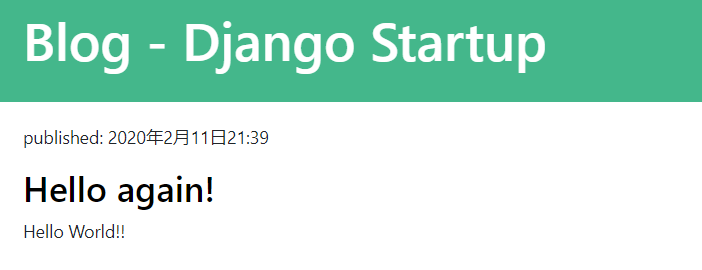

# 1. ブログ構築

はじめてのDjangoアプリ開発のチュートリアルです。

すぐにDjangoを使ってアプリを作ってみたい方向けです。

最初は、ブログを作って、Djangoの機能を理解するのがオススメです。

## GitHub準備

GitHubのリポジトリを作成します。


ローカルにリポジトリ名と同じフォルダを作成します。

ローカルフォルダとGitHubのリポジトリを連携します。
```
echo "# django-blog" >> README.md
git init
git add README.md
git commit -m "first commit"
git remote add origin https://github.com/haruyasu/django-blog.git
git push -u origin master
```
※作成したリポジトリ名に変更する

この時点でREADME.mdだけコミットされていると思います。

### ignoreファイルを追加

.gitignoreファイルを作成します。

記述されたファイルは、git管理下から除外されてコミットされなくなります。

.gitignore
```
myvenv
db.sqlite3
.vscode
__pycache__
*.pyc
```

## 仮想環境

仮想環境を作成する

```
$ python3 -m venv myvenv
```
## 仮想環境の開始
```
$ source myvenv/bin/activate
```
Djanogのインストール

pipを最新版にする
```
(myvenv) ~$ python3 -m pip install --upgrade pip
```
## requirementsファイルによってパッケージをインストールする

requirements.txtを作成する
```
django-template
├── myvenv
│   └── ...
└───requirements.txt
```

requirements.txt
```
Django~=2.2
django-heroku==0.3.1
gunicorn==19.9.0
```

Djangoをインストールする。

django-herokuはHerokuにデプロイする時に必要なパッケージです。

```
(myvenv) ~$ pip3 install -r requirements.txt
```

django-herokuをインストールすると、他のパッケージも複数同時にインストールされます。
もし、psycopg2をインストールする時にエラーが発生した場合は、python3-devをインストールします。

Linux(Ubuntu)の場合
```
sudo apt-get install python3-dev
```
※コマンドはOSによって変更する

## プロジェクトを作成する
```
(myvenv) ~$ django-admin startproject mysite .
```

## 設定変更

mysite/settings.pyに変更を加える

mysite/settings.py
```python:mysite/settings.py
ALLOWED_HOSTS = ['*']

LANGUAGE_CODE = 'ja'
TIME_ZONE = 'Asia/Tokyo'

STATIC_URL = '/static/'
STATIC_ROOT = os.path.join(BASE_DIR, 'static')
```

## データベースをセットアップ

```
(myvenv) ~$ python3 manage.py migrate
```

## Webサーバーを起動する

```
(myvenv) ~$ python3 manage.py runserver
```
URLにアクセスすると、Webページが表示されます。  
http://127.0.0.1:8000/

Webサーバーを停止するには、Ctrl + Cを同時に押すと停止します。


## 新しいアプリケーションの作成
```
(myvenv) ~$ python3 manage.py startapp blog
```
```
├── blog
│   ├── admin.py
│   ├── apps.py
│   ├── __init__.py
│   ├── migrations
│   │   └── __init__.py
│   ├── models.py
│   ├── tests.py
│   └── views.py
├── db.sqlite3
├── manage.py
├── mysite
│   ├── __init__.py
│   ├── settings.py
│   ├── urls.py
│   └── wsgi.py
├── myvenv
│   └── ...
└── requirements.txt
```

Djangoにアプリケーションを使えるように設定する

mysite/settings.py
```python:mysite/settings.py
# Application definition

INSTALLED_APPS = [
    'django.contrib.admin',
    'django.contrib.auth',
    'django.contrib.contenttypes',
    'django.contrib.sessions',
    'django.contrib.messages',
    'django.contrib.staticfiles',
    'blog.apps.BlogConfig',
]
```
## モデルの作成


```python:blog/models.py
from django.conf import settings
from django.db import models
from django.utils import timezone


class Post(models.Model):
    author = models.ForeignKey(settings.AUTH_USER_MODEL, on_delete=models.CASCADE)
    title = models.CharField(max_length=200)
    text = models.TextField()
    created_date = models.DateTimeField(default=timezone.now)
    published_date = models.DateTimeField(blank=True, null=True)

    def publish(self):
        self.published_date = timezone.now()
        self.save()

    def __str__(self):
        return self.title
```

## データベースにモデルのためのテーブルを作成する

```
(myvenv) ~$ python3 manage.py makemigrations blog
(myvenv) ~$ python3 manage.py migrate blog
```

## Django Admin

モデルをAdminページ(管理画面)上で見えるようにします。

blog/admin.py
```python:blog/admin.py
from django.contrib import admin
from .models import Post

admin.site.register(Post)
```

管理ユーザー作成

```
(myvenv) ~$ python3 manage.py createsuperuser
```
ユーザー名、メールアドレス、パスワードを入力します。  
パスワードは見えないので、間違えずに入力して下さい。

Webサーバー開始
```
(myvenv) ~$ python3 manage.py runserver
```

ユーザー名とパスワードを入力すると、ダッシュボードが見れます。


PostsをクリックしてPOSTを追加ボタンで、記事を追加する。


## URL追加

mysite/urls.py
```python:mysite/urls.py
from django.contrib import admin
from django.urls import path, include

urlpatterns = [
    path('admin/', admin.site.urls),
    path('', include('blog.urls')),
]
```

## blogのURL追加

urls.pyファイルを作成

blog/urls.py
```python:blog/urls.py
from django.urls import path
from . import views

urlpatterns = [
    path('', views.post_list, name='post_list'),
]
```

## View追加

blog/views.py
```python:blog/views.py
from django.shortcuts import render

def post_list(request):
    return render(request, 'blog/post_list.html', {})
```

## テンプレート追加

templatesフォルダとblogフォルダを追加する。
```
blog
└───templates
    └───blog
```

作成したblogフォルダにpost_list.htmlファイルを追加する。

blog/templates/blog/post_list.html
```html:blog/templates/blog/post_list.html
<html>
<body>
    <p>Hello!</p>
    <p>This is working.</p>
</body>
</html>
```

Webサーバー開始
```
(myvenv) ~$ python3 manage.py runserver
```
http://127.0.0.1:8000/

ページが表示されました。

## テンプレート内の動的データ

blog/views.py
```python:blog/views.py
from django.shortcuts import render
from django.utils import timezone
from .models import Post

def post_list(request):
    posts = Post.objects.filter(published_date__lte=timezone.now()).order_by('published_date')
    return render(request, 'blog/post_list.html', {'posts': posts})
```

## Djangoテンプレート

blog/templates/blog/post_list.html
```html:blog/templates/blog/post_list.html
<!DOCTYPE html>
<html lang="ja">
<head>
  <meta charset="UTF-8">
  <meta name="viewport" content="width=device-width, initial-scale=1.0">
  <title>Django Startup Template</title>
</head>
<body>
  <div>
    <h1><a href="/">Django Startup Template</a></h1>
  </div>

  
    <div>
      <p>published: {{ post.published_date }}</p>
      <h2><a href="">{{ post.title }}</a></h2>
      <p>{{ post.text|linebreaksbr }}</p>
    </div>
  
</body>
</html>
```

管理サイトでPostをPublishします。

Published dataを追記します。


Webサーバー開始
```
(myvenv) ~$ python3 manage.py runserver
```
http://127.0.0.1:8000/

投稿した内容が表示されます。


## CSSでデザインをする

blog.cssファイルを作成する

```
└── blog
    └── static
        └── css
            └── blog.css
```

blog/static/css/blog.css
```css:blog/static/css/blog.css
* {
  margin: 0;
  padding: 0;
}

a:hover {
  text-decoration: none;
}

.page-header {
  background-color: #44b78b;
  padding: 20px 20px 20px 40px;
}

.page-header h1,
.page-header h1 a,
.page-header h1 a:visited,
.page-header h1 a:active {
  color: #ffffff;
  font-size: 36pt;
  text-decoration: none;
}

.content {
  margin-left: 40px;
}

.date {
  color: #828282;
}

.save {
  float: right;
}

.post-form textarea,
.post-form input {
  width: 100%;
}

.top-menu,
.top-menu:hover,
.top-menu:visited {
  color: #ffffff;
  float: right;
  font-size: 26pt;
  margin-right: 20px;
}

.post {
  margin-bottom: 50px;
  padding: 20px 20px 20px 40px;
}

.post h2 a,
.post h2 a:visited {
  color: #000000;
}

.comment {
  margin: 20px 0px 20px 20px;
}
```

blog/templates/blog/post_list.html
```html:blog/templates/blog/post_list.html

<!DOCTYPE html>
<html lang="ja">

<head>
  <meta charset="UTF-8" />
  <meta name="viewport" content="width=device-width, initial-scale=1.0" />
  <title>Django Startup Template</title>
  <link rel="stylesheet" href="https://stackpath.bootstrapcdn.com/bootstrap/4.4.1/css/bootstrap.min.css">
  <link rel="stylesheet" href="https://cdnjs.cloudflare.com/ajax/libs/font-awesome/5.12.1/css/all.min.css">
  <link rel="stylesheet" href="" />
</head>

<body>
  <div class="page-header">
    <h1><a href="/">Blog - Django Startup</a></h1>
  </div>

  
  <div class="post">
    <p>published: {{ post.published_date }}</p>
    <h2><a href="">{{ post.title }}</a></h2>
    <p>{{ post.text|linebreaksbr }}</p>
  </div>
  
</body>

</html>
```

Webサイトを更新します。

CSSが反映されました。



## テンプレートを拡張する

HTMLの共通部分を取り出して、異なるページでも使えるようにします。
こうすることで、同じことを書く必要がなくなります。

base.htmlを作成する。
```
blog
└───templates
    └───blog
        ├── base.html
        └── post_list.html
```

blog/templates/blog/base.html
```html:blog/templates/blog/base.html

<!DOCTYPE html>
<html lang="ja">

<head>
  <meta charset="UTF-8" />
  <meta name="viewport" content="width=device-width, initial-scale=1.0" />
  <title>Django Startup Template</title>
  <link rel="stylesheet" href="https://stackpath.bootstrapcdn.com/bootstrap/4.4.1/css/bootstrap.min.css"
    integrity="sha384-Vkoo8x4CGsO3+Hhxv8T/Q5PaXtkKtu6ug5TOeNV6gBiFeWPGFN9MuhOf23Q9Ifjh" crossorigin="anonymous" />
  <link rel="stylesheet" href="" />
</head>

<body>
  <div class="page-header">
    <h1><a href="/">Blog - Django Startup</a></h1>
  </div>
  <div class="content container">
    <div class="row">
        <div class="col-md-8">
          
          
        </div>
    </div>
  </div>
</body>

</html>
```

postの内容を置き換えました。
内容が変わらない部分はbase.htmlに記載します。

blog/templates/blog/post_list.html
```html:blog/templates/blog/post_list.html



  
  <div class="post">
    <p>published: {{ post.published_date }}</p>
    <h2><a href="">{{ post.title }}</a></h2>
    <p>{{ post.text|linebreaksbr }}</p>
  </div>
  

```

post_list.htmlには内容が変わる部分を記載します。

先頭にはテンプレートを拡張することを追記します。

## アプリケーションを拡張する

投稿の詳細ページを作成します。

### 詳細へのリンクを作成する

post_list.htmlを変更しましょう。

blog/templates/blog/post_list.html
```html:blog/templates/blog/post_list.html
<h2><a href="">{{ post.title }}</a></h2>
```

### 投稿の詳細へのURLを作成する

URLのパターンを指定します。

blog/urls.py
```python:blog/urls.py
urlpatterns = [
    path('', views.post_list, name='post_list'),
    path('post/<int:pk>/', views.post_detail, name='post_detail'),
]
```

### 詳細のビューを追加する

view.pyにpost_detail関数を追加します。

blog/views.py
```python:blog/views.py
from django.shortcuts import render, get_object_or_404

def post_detail(request, pk):
    post = get_object_or_404(Post, pk=pk)
    return render(request, 'blog/post_detail.html', {'post': post})
```

### 詳細のテンプレートを追加する

post_detail.htmlファイルを追加します。

blog/templates/blog/post_detail.html
```html:blog/templates/blog/post_detail.html



<div class="post">
  
  <div class="date">
    {{ post.published_date }}
  </div>
  
  <h2>{{ post.title }}</h2>
  <p>{{ post.text|linebreaksbr }}</p>
</div>

```

投稿をクリックすると、詳細画面が表示されました。

## フォームの作成

フォームを作成して、Web上で記事を追加したり、編集したりします。

forms.pyファイルを追加します。

```
blog
   └── forms.py
```

blog/forms.py
```python:blog/forms.py
from django import forms
from .models import Post

class PostForm(forms.ModelForm):
  class Meta:
    model = Post
    fields = ('title', 'text',)
```

### フォームへのページリンクを作成

リンクを追加します。

blog/templates/blog/base.html
```html:blog/templates/blog/base.html
  <div class="page-header">
    <a href="" class="top-menu">post</a>
    <h1><a href="/">Blog - Django Startup</a></h1>
  </div>
```

### フォームのURLを追加

post/new/のURLを追加します。

blog/urls.py
```python:blog/urls.py
urlpatterns = [
    path('', views.post_list, name='post_list'),
    path('post/<int:pk>/', views.post_detail, name='post_detail'),
    path('post/new/', views.post_new, name='post_new'),
]
```

### フォームのビューを追加

blog/views.py
```python:blog/views.py
from .forms import PostForm

def post_new(request):
  form = PostForm()
  return render(request, 'blog/post_edit.html', {'form': form})
```

### フォームのテンプレートを追加

post_edit.htmlファイルを追加します。

blog/templates/blog/post_edit.html
```html:blog/templates/blog/post_edit.html



  <h2>New post</h2>
  <form method="POST" class="post-form">
    {{ form.as_p }}
    <button type="submit" class="save btn btn-default">Save</button>
  </form>

```

### フォームを保存

post_new関数を書き換えます。

blog/views.py
```python:blog/views.py
from django.shortcuts import redirect

def post_new(request):
  if request.method == "POST":
    form = PostForm(request.POST)
    if form.is_valid():
      post = form.save(commit=False)
      post.author = request.user
      post.published_date = timezone.now()
      post.save()
      return redirect('post_detail', pk=post.pk)
  else:
    form = PostForm()
  return render(request, 'blog/post_edit.html', {'form': form})
```

### フォームの編集

Editボタンを追加します。

blog/templates/blog/post_detail.html
```html:blog/templates/blog/post_detail.html



<div class="post">
  
  <div class="date">
    {{ post.published_date }}
  </div>
  
  <a class="btn btn-default" href="">Edit</a>
  <h2>{{ post.title }}</h2>
  <p>{{ post.text|linebreaksbr }}</p>
</div>

```

editのリンクを追加します。

blog/urls.py
```python:blog/urls.py
urlpatterns = [
    path('', views.post_list, name='post_list'),
    path('post/<int:pk>/', views.post_detail, name='post_detail'),
    path('post/new/', views.post_new, name='post_new'),
    path('post/<int:pk>/edit/', views.post_edit, name='post_edit'),
]
```

ビューに追記します。

blog/views.py
```python:blog/views.py
def post_edit(request, pk):
  post = get_object_or_404(Post, pk=pk)
  if request.method == "POST":
    form = PostForm(request.POST, instance=post)
    if form.is_valid():
      post = form.save(commit=False)
      post.author = request.user
      post.published_date = timezone.now()
      post.save()
      return redirect('post_detail', pk=post.pk)
  else:
    form = PostForm(instance=post)
  return render(request, 'blog/post_edit.html', {'form': form})
```

これで、ブログ投稿、編集ができるアプリケーションが完成しました。

## セキュリティ対策

ブログの投稿、編集はログインしている人だけにできるように変更しましょう。

ログインしている人だけに表示するように制限することができます。

blog/templates/blog/base.html
```html:blog/templates/blog/base.html

  <a href="" class="top-menu">Post</i></a>

```

blog/templates/blog/post_detail.html
```html:blog/templates/blog/post_detail.html

  <a class="btn btn-default" href="">Edit</a>

```

## 機能を追加

## 下書き機能を追加

今までは投稿するとすぐに公開されましたが、下書きに保存することができます。
blog/views.pyのpost_new関数とpost_edit関数にあるpost.published_dateを削除します。

blog/views.py
```python:blog/views.py
post.published_date = timezone.now()
```

base.htmlにDraftボタンを追加する。

blog/templates/blog/base.html
```html:blog/templates/blog/base.html
<a href="" class="top-menu">Draft</a>
```

urls.pyにurlを追加する。

blog/urls.py
```python:blog/urls.py
path('drafts/', views.post_draft_list, name='post_draft_list'),
```

下書き機能をビューに追加する。

blog/views.py
```python:blog/views.py
def post_draft_list(request):
  posts = Post.objects.filter(
      published_date__isnull=True).order_by('created_date')
  return render(request, 'blog/post_draft_list.html', {'posts': posts})
```

post_draft_list.htmlファイルを追加し、テンプレートを作成する。

blog/templates/blog/post_draft_list.html
```html:blog/templates/blog/post_draft_list.html



  
    <div class="post">
      <p class="date">created: {{ post.created_date|date:'d-m-Y' }}</p>
      <h1><a href="">{{ post.title }}</a></h1>
      <p>{{ post.text|truncatechars:200 }}</p>
    </div>
  

```

draftsページを開くと下書きが表示されます。

http://127.0.0.1:8000/drafts/

### 公開ボタンを追加

blog/templates/blog/post_detail.html
```html:blog/templates/blog/post_detail.html

  <div class="date">
    {{ post.published_date }}
  </div>

    <a class="btn btn-default" href="">Publish</a>

```

urls.pyにurlを追加する。

blog/urls.py
```python:blog/urls.py
path('post/<pk>/publish/', views.post_publish, name='post_publish'),
```

ビューを追加する。

blog/views.py
```python:blog/views.py
def post_publish(request, pk):
  post = get_object_or_404(Post, pk=pk)
  post.publish()
  return redirect('post_detail', pk=pk)
```

## 削除機能を追加

削除ボタンを追加する。

編集ボタンの下に追加します。

blog/templates/blog/post_detail.html
```html:blog/templates/blog/post_detail.html
<a class="btn btn-default" href="">Delete</a>
```

urlも追加します。

blog/urls.py
```python:blog/urls.py
path('post/<pk>/remove/', views.post_remove, name='post_remove'),
```

ビューも追加します。

blog/views.py
```python:blog/views.py
def post_remove(request, pk):
  post = get_object_or_404(Post, pk=pk)
  post.delete()
  return redirect('post_list')
```

投稿を削除できるようになりました。

## セキュリティを強化する

view.pyに追記します。

blog/views.py
```python:blog/views.py
from django.contrib.auth.decorators import login_required
```

post_new, post_edit, post_draft_list, post_remove, post_publish関数の上にデコレーターを追記します。
```python:blog/views.py
@login_required
def post_new(request):
    [...]
```

### ユーザーログイン機能

ログイン、ログアウト機能を実装します。

mysite/urls.py
```python:mysite/urls.py
from django.contrib import admin
from django.urls import path, include
from django.contrib.auth import views

urlpatterns = [
    path('admin/', admin.site.urls),
    path('accounts/login/', views.LoginView.as_view(), name='login'),
    path('accounts/logout/', views.LogoutView.as_view(next_page='/'), name='logout'),
    path('', include('blog.urls')),
]
```

blog/templates/registrationフォルダを作成し、login.htmlファイルを作成します。

blog/templates/registration/login.html
```html:blog/templates/registration/login.html



  
    <p>Your username and password didn't match. Please try again.</p>
  

  <form method="post" action="">
  
    <table>
    <tr>
      <td>{{ form.username.label_tag }}</td>
      <td>{{ form.username }}</td>
    </tr>
    <tr>
      <td>{{ form.password.label_tag }}</td>
      <td>{{ form.password }}</td>
    </tr>
    </table>

    <input type="submit" value="login" />
    <input type="hidden" name="next" value="{{ next }}" />
  </form>

```

mysite/settings.pyを変更します。

下記のコードを一番下に追加します。

mysite/settings.py
```python:mysite/settings.py
LOGIN_REDIRECT_URL = '/'
```

テンプレートを変更する

blog/templates/blog/base.html
```html:blog/templates/blog/base.html

  <a href="" class="top-menu">Post</a>
  <a href="" class="top-menu">Draft</a>
  <p class="top-menu">Hello {{ user.username }} <small>(<a href="">Log out</a>)</small></p>

    <a href="" class="top-menu">Login</a>

```

ログイン、ログアウト機能が実装されました。

ログインして、投稿、編集、削除ボタンが表示されていることを確認してみて下さい。
そして、ログアウトすると、投稿、編集、削除ボタンが表示されないと思います。

## コメントを実装する

### コメントモデルを実装する

models.pyに追記します。

blog/models.py
```python:blog/models.py
class Comment(models.Model):
  post = models.ForeignKey(
    'blog.Post', on_delete=models.CASCADE, related_name='comments')
  author = models.CharField(max_length=200)
  text = models.TextField()
  created_date = models.DateTimeField(default=timezone.now)
  approved_comment = models.BooleanField(default=False)

  def approve(self):
    self.approved_comment = True
    self.save()

  def __str__(self):
    return self.text
```

### データベースにコメントモデルのテーブルを追加する

```
(myvenv) ~$ pthon3 manage.py makemigrations blog
(myvenv) ~$ python3 manage.py migrate blog
```
### 管理画面にコメントモデルを登録する

blog/admin.py
```python:blog/admin.py
from django.contrib import admin
from .models import Post, Comment

admin.site.register(Post)
admin.site.register(Comment)
```

管理画面にアクセスするとコメントの追加や削除が出来るようになっています。

http://127.0.0.1:8000/admin/blog/comment/

### コメントを表示する

最後のの前に追記します。

blog/templates/blog/post_detail.html
```html:blog/templates/blog/post_detail.html
<hr>

  <div class="comment">
    <div class="date">{{ comment.created_date }}</div>
    <strong>{{ comment.author }}</strong>
    <p>{{ comment.text|linebreaks }}</p>
  </div>

  <p>No comments here yet :(</p>

```

投稿ページでコメントの数を表示する。

blog/templates/blog/post_list.html
```html:blog/templates/blog/post_list.html



  
  <div class="post">
    <div class="date">
        {{ post.published_date }}
    </div>
    <h1><a href="">{{ post.title }}</a></h1>
    <p>{{ post.text|linebreaksbr }}</p>
    <a href="">Comments: {{ post.comments.count }}</a>
  </div>
  

```

### コメントを投稿する

forms.pyファイルを変更する。

blog/forms.py
```python:blog/forms.py
from django import forms
from .models import Post, Comment

class PostForm(forms.ModelForm):
  class Meta:
    model = Post
    fields = ('title', 'text',)


class CommentForm(forms.ModelForm):
  class Meta:
    model = Comment
    fields = ('author', 'text',)

```
コメントを投稿するボタンを追加する。

blog/templates/blog/post_detail.html
```html:blog/templates/blog/post_detail.html
<hr>
<a class="btn btn-default" href="">Add comment</a>

```

urls.pyにコメントのurlを追加する。

blog/urls.py
```python:blog/urls.py
path('post/<int:pk>/comment/', views.add_comment_to_post, name='add_comment_to_post'),
```

ビューを追加する。

blog/views.py
```python:blog/views.py
from .forms import PostForm, CommentForm

def add_comment_to_post(request, pk):
  post = get_object_or_404(Post, pk=pk)
  if request.method == "POST":
    form = CommentForm(request.POST)
    if form.is_valid():
      comment = form.save(commit=False)
      comment.post = post
      comment.save()
      return redirect('post_detail', pk=post.pk)
  else:
    form = CommentForm()
  return render(request, 'blog/add_comment_to_post.html', {'form': form})
```

コメントを投稿するテンプレートを作成する。

blog/templates/blog/add_comment_to_post.html
```html:blog/templates/blog/add_comment_to_post.html



  <h1>New comment</h1>
  <form method="POST" class="post-form">
    {{ form.as_p }}
    <button type="submit" class="save btn btn-default">Send</button>
  </form>

```

### コメントを管理する

コメントを承認または削除できるようにします。

RemoveボタンとApproveボタンを追加します。

blog/templates/blog/post_detail.html
```html:blog/templates/blog/post_detail.html
<div class="date">
  {{ comment.created_date }}
  
    <a class="btn btn-default" href="">Remove</a>
    <a class="btn btn-default" href="">Approve</a>
  
</div>
```

urls.pyにurlを追加する。

blog/urls.py
```python:blog/urls.py
  path('comment/<int:pk>/approve/', views.comment_approve, name='comment_approve'),
  path('comment/<int:pk>/remove/', views.comment_remove, name='comment_remove'),
```

ビューを追加する。

blog/views.py
```python:blog/views.py
from .models import Post, Comment

@login_required
def comment_approve(request, pk):
  comment = get_object_or_404(Comment, pk=pk)
  comment.approve()
  return redirect('post_detail', pk=comment.post.pk)

@login_required
def comment_remove(request, pk):
  comment = get_object_or_404(Comment, pk=pk)
  comment.delete()
  return redirect('post_detail', pk=comment.post.pk)
```

これで、コメントの承認と削除ができるようになりました。

承認されたコメント数を表示する。

blog/templates/blog/post_list.html
```html:blog/templates/blog/post_list.html
<a href="">Comments: {{ post.approved_comments.count }}</a>
```

モデルを追加する。

Postモデルに追加する。

blog/models.py
```python:blog/models.py
class Post(models.Model):

  def approved_comments(self):
    return self.comments.filter(approved_comment=True)
```

以上で、ブログアプリケーションの構築が完了です。

## Herokuにデプロイする

デプロイとは、特定の環境下でアプリケーションやシステムを使えるようにすることです。

Herokuにデプロイして、Webアプリケーションを世界中に公開しましょう。

デプロイすることによって、多くの人にあなたのWebアプリケーションを使ってもらえるようになります。

### デプロイ準備

#### パッケージ定義

freezeコマンドをすることによって、アプリを動かすためのパッケージを一覧にまとめることができます。

```
(myvenv) ~$ pip3 freeze > requirements.txt
```

このような内容になります。バージョンは実行時期によって異なります。

requirements.txt
```
asgiref==3.2.3
dj-database-url==0.5.0
Django==2.2.10
django-heroku==0.3.1
gunicorn==19.9.0
psycopg2==2.8.4
pytz==2019.3
sqlparse==0.3.0
whitenoise==5.0.1
```

#### Procfile作成

Procfileは、アプリのプロセスタイプやエントリーポイントを宣言するファイルです。

Procfileを作成する。

```
django-template
└── Procfile
```

Procfile
```
web: gunicorn mysite.wsgi
```

mysiteの部分はあなたが作成したアプリのディレクトリ名を指定します。

gunicornと、HerokuでDjangoをデプロイするときに必要なWebサーバーです。

#### runtime.txt作成

runtime.txtにはプログラム実行時に必要なものを定義します。

ここではPythonが必要なのでPythonのバージョンを指定します。

runtime.txtを作成する。

```
django-template
└── runtime.txt
```

runtime.txt
```
python-3.6.9
```

### Herokuを操作

Herokuにデプロイする準備ができましたので、Herokuを操作していきます。

#### Herokuアカウント作成

まずはHerokuのアカウントを作成します。

https://signup.heroku.com/

#### Heroku CLIインストール

OSに合わせてHeroku CLIをインストールします。

インストールすることによって、コマンドラインからHerokuの操作が出来るようになります。

https://devcenter.heroku.com/articles/getting-started-with-python#set-up

#### Herokuにログイン

ターミナルからHerokuにログインします。

```
$ heroku login
```

コマンドを実行すると、ログイン用のWebページが表示されますので、ログインボタンを押して下さい。


#### Herokuプロジェクト作成

Herokuにプロジェクトを作成します。

好きなプロジェクト名を指定して下さい。

このプロジェクト名がURLになりますので、既に他の人に使われているプロジェクト名は指定できません。

```
$ heroku create django-template-blog
```

このように表示されたら成功です。
```
Creating ⬢ django-template-blog... done
https://django-template-blog.herokuapp.com/ | https://git.heroku.com/django-template-blog.git
```

#### Herokuにpushする

Herokuにpushする前に、GitHubにすべてコミットしておいて下さい。

```
$ git push heroku master
```

デプロイ完了とメッセージが表示されます。
```
remote:        https://django-template-blog.herokuapp.com/ deployed to Heroku
remote: 
remote: Verifying deploy... done.
To https://git.heroku.com/django-template-blog.git
 * [new branch]      master -> master
```

#### プロセスを起動する

このままだとgunicornのサーバーが起動していないため、アプリケーションが起動しません。

以下のコマンドで起動します。

```
$ heroku ps:scale web=1
```

このように表示されたら成功です。
```
Scaling dynos... done, now running web at 1:Free
```

#### Herokuのデータベースを構築

migrateコマンドをしてデータベースを構築します。

```
$ heroku run python manage.py migrate
```

このように表示されたら成功です。
```
Running python manage.py migrate on ⬢ django-template-blog... up, run.5146 (Free)
Operations to perform:
  Apply all migrations: admin, auth, blog, contenttypes, sessions
Running migrations:
  Applying contenttypes.0001_initial... OK
  Applying auth.0001_initial... OK
  Applying admin.0001_initial... OK
  Applying admin.0002_logentry_remove_auto_add... OK
  Applying admin.0003_logentry_add_action_flag_choices... OK
  Applying contenttypes.0002_remove_content_type_name... OK
  Applying auth.0002_alter_permission_name_max_length... OK
  Applying auth.0003_alter_user_email_max_length... OK
  Applying auth.0004_alter_user_username_opts... OK
  Applying auth.0005_alter_user_last_login_null... OK
  Applying auth.0006_require_contenttypes_0002... OK
  Applying auth.0007_alter_validators_add_error_messages... OK
  Applying auth.0008_alter_user_username_max_length... OK
  Applying auth.0009_alter_user_last_name_max_length... OK
  Applying auth.0010_alter_group_name_max_length... OK
  Applying auth.0011_update_proxy_permissions... OK
  Applying blog.0001_initial... OK
  Applying blog.0002_comment... OK
  Applying sessions.0001_initial... OK
```

#### 管理ユーザーを作成

ローカルと同じようにHerokuでも管理ユーザーを作成することができます。

```
$ heroku run python manage.py createsuperuser
```

ユーザー名、メールアドレス、パスワードを入力します。
パスワードの入力は表示されませんので、間違えずに入力して下さい。
```
Running python manage.py createsuperuser on ⬢ django-template-blog... up, run.6023 (Free)
ユーザー名:
メールアドレス:
Password: 
Password (again): 
Superuser created successfully.
```

これで無事デプロイ完了です。

デプロイしたURLにアクセスしてみましょう。

https://django-template-blog.herokuapp.com/

ローカルと同じ画面が表示されているはずです。

最初はデータがない初期状態なので、ブログを投稿してみましょう。

## セキュリティを高める

デプロイは成功しましたが、セキュリティ上の問題があります。

### DebugをFalseにする

現在、Debug機能が有効になっているため、もしエラーが発生した場合、詳細な情報が表示されてしまいます。

ローカルではいいのですが、本番環境で詳細な情報は表示されたくありません。

.gitignoreファイルに、local_settings.pyを追記します。

.gitignore
```
local_settings.py
```

local_settings.pyファイルを作成します。

ローカルのみDEBUG機能を有効にします。

mysite/local_settings.py
```python:mysite/local_settings.py
import os

BASE_DIR = os.path.dirname(os.path.dirname(os.path.abspath(__file__)))
DATABASES = {
    'default': {
        'ENGINE': 'django.db.backends.sqlite3',
        'NAME': os.path.join(BASE_DIR, 'db.sqlite3'),
    }
}
DEBUG = True
```

setting.pyを変更します。

mysite/settings.py
```python:mysite/settings.py
# Falseに変更
DEBUG = False

# 追加
try:
    from .local_settings import *
except ImportError:
    pass

# Debug=Falseの時だけ実行する設定
if not DEBUG:
    import django_heroku
    django_heroku.settings(locals())
```

GitHubにコミットしておきます。

Herokuにもpushします。

```
$ git push heroku master
```

これで本番環境でデバッグ機能が無効になり、詳細な情報が表示されなくなりました。

存在しないURLを打ってみましょう。

Not Foundと表示されるはずです。


ローカルで存在しないURLを打ってみると、詳細な情報が表示されます。


### SECRET KEYがハードコーディングされている

セキュリティ上、SECRET KEYを直接書くのは良くありません。

先ほど作成した、local_settings.pyにSECRET_KEYを移動させましょう。

mysite/local_settings.py
```python:mysite/local_settings.py
# SECURITY WARNING: keep the secret key used in production secret!
SECRET_KEY = 'xxxxxxxxxxxxxxxxxxxx'
```

settings.pyのSECRET_KEYは削除します。

mysite/settings.py
```python:mysite/settings.py
# 削除
SECRET_KEY = 'xxxxxxxxxxxxxxxxxxxx'

if not DEBUG:
    import django_heroku
    django_heroku.settings(locals())
    SECRET_KEY = os.environ['SECRET_KEY']
```

本番環境でSECRET_KEYを設定するには、heroku config:setコマンドを使います。

実際のSECRET_KEYに置き換えて実行します。

```
$ heroku config:set SECRET_KEY="xxxx"
```

heroku configコマンドでHerokuの環境変数を見ることができます。

```
$ heroku config
```
SECRET_KEYが表示されていれば成功です。

本番環境が動作するか確認しておきましょう。

DjangoでWebアプリケーションの作成方法が分かったのではないでしょうか。

ぜひ色々試して機能を追加して、さらに理解を深めていきましょう。

以上
