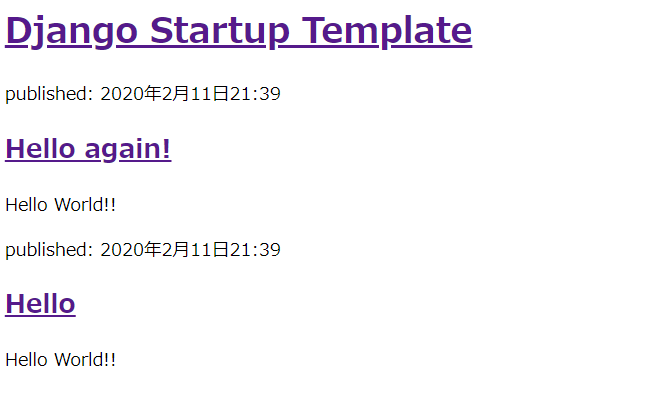

## テンプレート

blog/templates/blog/post_list.html
```html:blog/templates/blog/post_list.html
<!DOCTYPE html>
<html lang="ja">
<head>
  <meta charset="UTF-8">
  <meta name="viewport" content="width=device-width, initial-scale=1.0">
  <title>Django Startup Template</title>
</head>
<body>
  <div>
    <h1><a href="/">Django Startup Template</a></h1>
  </div>

  
    <div>
      <p>published: {{ post.published_date }}</p>
      <h2><a href="">{{ post.title }}</a></h2>
      <p>{{ post.text|linebreaksbr }}</p>
    </div>
  
</body>
</html>
```

管理サイトでPostをPublishします。

Published dataを追記します。


Webサーバー開始
```
(myvenv) ~$ python3 manage.py runserver
```
http://127.0.0.1:8000/

投稿した内容が表示されます。


